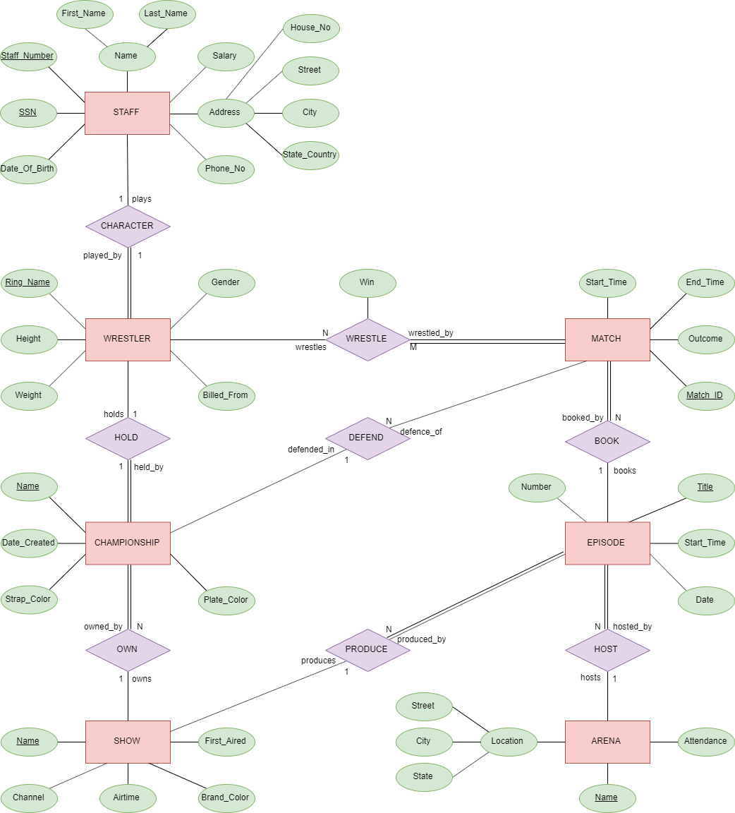

# Database Design Project

## Task
Design and implement your own database based on the following requirements:

- A *minimum* of 6 relational tables
- Appropriate implicit constraints (including primary & foreign keys)
- Explicit (semantic) constraints such as table constraint(s) and triggers (you need not implement assertions)
- At least one view should also be defined within the database
- A minimum of 5 tuples per table

**Note:** Additional marks will be awarded for innovation and degree of difficulty (in use of SQL). Examples of extra features which could include: examples of the use of variables in SQL/PL, etc.
You are required to implement the database using MySQL.

## Implementation
A database for World Wrestling Entertainment, Inc.
Relations:
- Wrestler
- Championship
- Show
- Arena
- Episode
- Match

